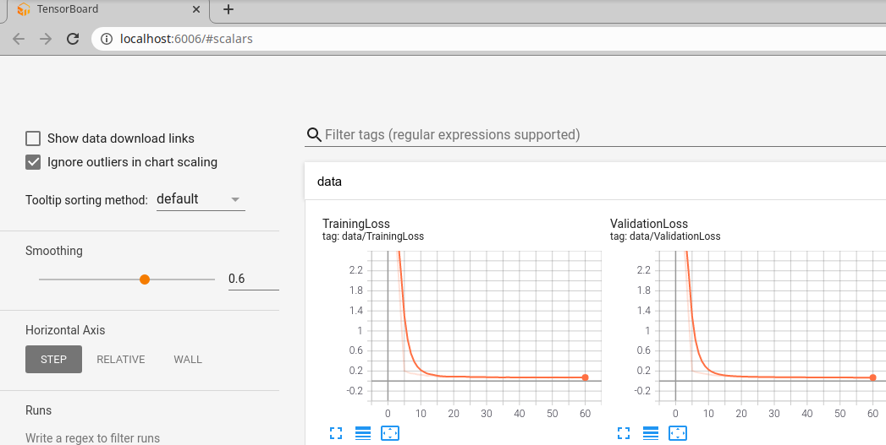
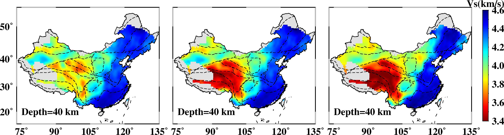

# SurfTomoCNN-new
  Using deep-learning technique to perform surface wave tomography 
  
# Install environment 
You should have Anaconda3.4 and Matlab>=2014

`pip install requirement.txt`

# Generate training dataset

`cd ./1BuildTrainingTestDataset` # see readme and run some scripts to genertate training dataset

# Train

`cd ./2TrainingAndTestScripts`

All training parameters used during training can be modified in `config.py` 

```python
class Config(object):
    def __init__(self):
        self.filepath_disp_training = '../DataSet/TrainingData/0.5km/USA_Tibet/disp_combine_gaussian_map/'
        self.filepath_vs_training   = '../DataSet/TrainingData/0.5km/USA_Tibet/vs_curve/'
        self.filepath_disp_real    = '../DataSet/TestData/real-8s-50s/China/disp_pg_real/' 
        self.batch_size = 64     # training batch size
        self.nEpochs = 600       # maximum number of epochs to train for
        self.lr = 0.00001        # learning rate
        self.seed = 123          # random seed to use. Default=123
        self.plot = True         # show validation result during training
        self.alpha=0.0000        # damping, not used here
        self.testsize=0.2
        self.pretrained =True
        self.start=600           # training from 600th model.
        self.pretrain_net = "./model_para/model_epoch_"+str(self.start)+".pth"
```


For training, please set `self.filepath_disp_training` and `self.filepath_vs_training`

`python Main_Train.py`

# Watch training loss and validation loss variation 

`tensorboard --logdir ./runs`



# Plot final training and validation loss

After training, then you plot training loss and validation loss for publish

`python ./PlotTraingLoss.py # you should change some parameters in this script` .

# Predicting  

For prediction, set your real dispersion curve path `self.filepath_disp_real`

Set `self.start=number`,  number is your model ID stored in `./model_para/` 

`self.pretrained` must be `True`

The name and content of real dispersion curve file should be like examples

e.g. lat_lon.txt

    period1 ph_vel1 ph_un1 gr_vel1 gr_un1
    period2 ph_vel2 ph_un2 gr_vel2 gr_un2
    ....

    periodN ph_velN ph_unN gr_velN gr_unN

`python Main_Predict.py`

## Extract Vs map at a depth layer

`cd ./ExtractResultMap`

see Readme to run some scritps.

copy layers_vs_usa and layers_vs_usa_tibet to `../3GMT_plotResults/`

# Plot Vs Result

`cd ../3GMT_plotResults`

See readme to run some scripts to plot results.



Left to right: Test1 (usa data as training dataset), Test2 (usa-tibet as training dataset), Shen et al. (2016)


By Jing Hu
Date 2020-11-24
Email jhsa920@163.com
